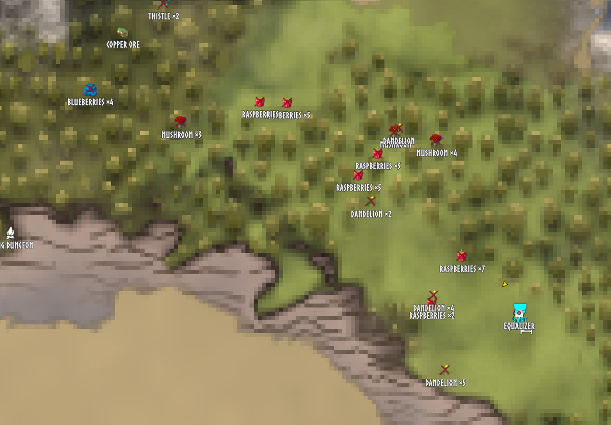
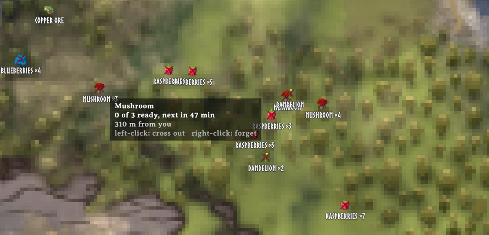

# Trove

A client-side Valheim mod that remembers where you gathered.

Pick a raspberry bush, a ring of mushrooms or a clump of thistle, or put a pickaxe into a copper
deposit, and the spot becomes a pin on your map: the item's own icon, one pin per patch with a
count, crossed out while the patch is picked clean and back to normal once it has regrown, gone
when the ore is mined out.

Nothing is scanned and nothing is revealed. The map only ever shows what you have touched.

Built against **Valheim 1.0.15**. Nothing to install on the server.

**One pin per patch, with a count and the item's own icon.** Crossed out where everything is
picked; the copper pin goes when the deposit is mined out.

**Hover a patch** for what is in it, how much is ready and when the rest grows back.

## Install

Requires BepInEx 5. Drop `Trove.dll` into `BepInEx/plugins/` or install through a mod manager.

## Why interaction, not radar

Most auto-pin mods sweep a radius around you and stamp the map with everything they find, which
is why mods exist purely to clean up after them. Trove only ever records the thing you actually
picked or hit. A patch on your map is somewhere you have stood, which keeps exploration worth
doing and keeps the map readable.

## How it works

- A wild pickable is remembered the moment you pick it. Picks of the same item within 20 m share
  one pin, so a berry row is one pin reading "Raspberries ×6", not six pins.
- The pin is crossed out when everything in the patch is picked and clears itself when the first
  plant has grown back, using the game's own respawn time for that plant.
- An ore node is remembered on the first pickaxe hit and forgotten once it is 90% mined, because
  copper and silver always leave fragments below the dig limit.
- Hover a patch for what is in it, how much is ready and when the rest grows back. Left-click
  crosses it out by hand, right-click forgets it.
- Harvesting inside a workbench radius is ignored, so your farm never pins itself. Branches and
  surface flint are ignored too: they grow back, but a pin per stick is not worth the map.
- Nothing is hard-coded. What counts as a pickable or an ore node is read from the game's own
  prefabs at load, so Deep North content and modded resources work without an update.

## Your pins stay yours

Trove's pins are never written into your character file and never shared through the cartography
table. They live in `BepInEx/config/Trove/<world>.tsv`, one plain text file per world, shared by
every character on that world.

## Settings

Everything is configurable, including the cluster radii, the ignore lists and the depleted
threshold. Notable defaults:

| Setting | Default | What it does |
|---|---|---|
| `Gather.ClusterRadius` | 20 | Metres within which picks of one item share a pin |
| `Gather.SkipPlayerBases` | true | Ignore harvests inside a workbench radius |
| `Gather.ExcludedItems` | Wood, Frostwood, Flint | Never pinned |
| `Mine.DepletedPercent` | 90 | Forget a deposit at this share mined |
| `Mine.IgnoredDrops` | Stone, Grausten, Wood, Frostwood, Coal | Do not make a rock worth remembering |
| `Pins.ShowOnMinimap` | false | Large map only by default |

Changing a default only affects a fresh install. BepInEx keeps values that already exist in your
config file.

## Console

`trove list`, `trove catalog`, `trove save`, `trove unforget`, `trove clear yes`.

## Licence

MIT. See [LICENSE](LICENSE).
